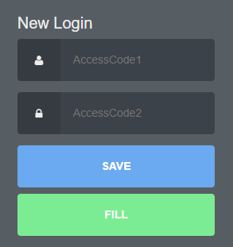

# +4upass 

Extension for credentials management with autofill feature for plus4u services.

### Supported Browsers

## Features
- set credentials for the given domain
- passwords are filled after right-clicking the page and selecting the AutoFill value from the context menu
- password can be also filled right from the extension popup

### context menu

### extension popup

## Installation
1. clone this git repository
2. open Chrome browser and page with extensions
3. turn on the developer mode 
4. import as extracted package - select the folder with cloned git repository
5. done 🙌

## Todos
- migration to IndexedDB
- import/export feature
- multiple accounts per domain
- autofill right from the password input type
- store data under master key, automatic invalidation of key after 5 minutes
- settings screen, allowing manage all data
